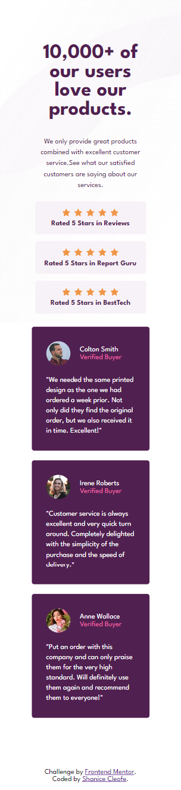

# Frontend Mentor - Social proof section solution

This is a solution to the [Social proof section challenge on Frontend Mentor](https://www.frontendmentor.io/challenges/social-proof-section-6e0qTv_bA). Frontend Mentor challenges help you improve your coding skills by building realistic projects.

## Table of contents

- [Overview](#overview)
  - [The challenge](#the-challenge)
  - [Screenshot](#screenshot)
  - [Links](#links)
- [My process](#my-process)
  - [Built with](#built-with)
  - [What I learned](#what-i-learned)
  - [Useful resources](#useful-resources)
- [Author](#author)

## Overview

### The challenge

Users should be able to:

- View the optimal layout for the section depending on their device's screen size

### Screenshot

Desktop Preview
---

Mobile Preview
---

### Links

- Solution URL: [Frontend Mentor Solution](https://www.frontendmentor.io/solutions/social-proof-section-n1Tc76X3p)
- Live Site URL: [Social Proof Section Layout](https://sdacleofe.github.io/social-proof-section-master-main/)

## My process

### Built with

- Semantic HTML5 markup
- CSS custom properties
- Flexbox
- Sass

### What I learned

Have gained greater proficiency in experimenting with semantic elements, CSS positioning like relative and absolute, employing CSS width and max-width, and utilizing Flexbox properties. I also suggest considering the use of Sass, as it proves to be much more efficient compared to traditional CSS.

### Useful resources

- [ChatGPT](https://chat.openai.com/) - This helped me for finding answers to my questions. I really liked this pattern and will use it going forward.

## Author

- Website - [Shanice](https://github.com/sdacleofe/about-me)
- Frontend Mentor - [@sdacleofe](https://www.frontendmentor.io/profile/sdacleofe)
